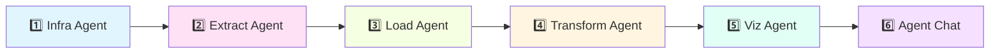

# 🚀 app_production/

## 📌 **O que é este diretório?**

Este diretório contém **TODOS os arquivos de PRODUÇÃO** que estão **ativamente rodando** nos ambientes:

- ✅ **Cloud Run** (GCP) - Jobs de extração
- ✅ **Databricks** - Notebooks DLT, pipelines e jobs
- ✅ **Cloud Functions** - Funções serverless (se aplicável)

**⚠️ IMPORTANTE:** 
- Arquivos aqui foram **validados, testados e aprovados**
- Mudanças neste diretório **afetam produção diretamente**
- **SEMPRE** teste antes de fazer alterações
- Segue processo de **CI/CD** via GitHub Actions

---

## 🎯 **Por que existe este diretório separado?**

### **Separação de Ambientes (Best Practice)**

```
┌────────────────────────────────────────┐
│  app_production/  ← PRODUÇÃO 🚀        │
│  ✅ Código validado                    │
│  ✅ Roda em Cloud Run + Databricks     │
│  ✅ Versionado e rastreável            │
│  ✅ Deploy via CI/CD                   │
└────────────────────────────────────────┘

┌────────────────────────────────────────┐
│  desenvolvimento/  ← DESENVOLVIMENTO   │
│  🔬 Experimentos                       │
│  🔬 Protótipos                         │
│  🔬 Testes locais                      │
└────────────────────────────────────────┘

┌────────────────────────────────────────┐
│  scripts/  ← UTILITÁRIOS               │
│  🔧 Scripts auxiliares                 │
│  🔧 Debug                              │
│  🔧 Ferramentas                        │
└────────────────────────────────────────┘
```

### **Benefícios:**
1. **Clareza** - Sabe-se exatamente o que roda em produção
2. **Segurança** - Evita deploy acidental de código não testado
3. **Rastreabilidade** - Git history mostra mudanças em produção
4. **Manutenibilidade** - Fácil identificar código crítico
5. **Escalabilidade** - Estrutura suporta múltiplos ambientes

---

## 📂 **Estrutura Interna**

```
app_production/
│
├── agents/                    # 🤖 AGENTES DO PIPELINE (6 agentes)
│   ├── control_agent/         # Orquestrador principal
│   ├── extract_agent/         # Extração LinkedIn (Cloud Run)
│   ├── load_agent/            # Carregamento Unity Catalog
│   ├── transform_agent/       # DLT Bronze→Silver→Gold (Databricks)
│   │   └── notebooks/         # Notebooks DLT de produção
│   ├── infra_agent/           # Configuração infraestrutura GCP/Databricks
│   └── viz_agent/             # Dashboards e visualizações Lakeview
│
├── notebooks/                 # 📓 NOTEBOOKS DATABRICKS
│   ├── agent_chat_standalone.py           # Notificações Telegram
│   └── linkedin_pipeline_runner_notebook.py  # Runner do pipeline
│
└── agent_chat.py              # 💬 Agent Chat (biblioteca)
```

---

## 🔄 **Pipeline de Produção (6 Agentes)**

Este diretório implementa um **pipeline completo** de dados usando **arquitetura de agentes**:



### **Fluxo Completo:**

| # | Agente | O que faz | Onde roda |
|---|--------|-----------|-----------|
| 1 | **Infra Agent** | Configura infraestrutura GCP/Databricks | Terraform + Scripts |
| 2 | **Extract Agent** | Extrai vagas do LinkedIn via RapidAPI | **Cloud Run (GCP)** |
| 3 | **Load Agent** | Carrega JSONL → Unity Catalog (raw) | **Databricks** |
| 4 | **Transform Agent** | DLT: Bronze → Silver → Gold | **Databricks Pipelines** |
| 5 | **Viz Agent** | Cria views e dashboards Lakeview | **Databricks SQL** |
| 6 | **Agent Chat** | Notifica vagas via Telegram | **Databricks Jobs** |

---

## 🚀 **Ambientes de Produção**

### **1. Cloud Run (GCP)**

**Job:** `vaga-linkedin-prod-staging`

- **Função:** Extract Agent - extração de dados
- **Trigger:** Push na branch `main` (via CI/CD)
- **Código fonte:** `app_production/agents/extract_agent/`
- **Runtime:** Python 3.11 + Playwright
- **Output:** Salva JSONL em `gs://bucket/bronze-raw/`

### **2. Databricks**

**Notebooks deployados** (via CI/CD):

| Notebook | Path no Databricks | Função |
|----------|-------------------|--------|
| `dlt_data_engineer_transformation.py` | `/Shared/dlt_data_engineer_transformation` | Pipeline DLT - Data Engineer |
| `dlt_data_analytics_transformation.py` | `/Shared/dlt_data_analytics_transformation` | Pipeline DLT - Data Analytics |
| `dlt_digital_analytics_transformation.py` | `/Shared/dlt_digital_analytics_transformation` | Pipeline DLT - Digital Analytics |
| `agent_chat_standalone.py` | `/Shared/agent_chat_standalone` | Notificações Telegram |
| `linkedin_pipeline_runner_notebook.py` | `/Shared/linkedin_pipeline_runner_notebook` | Runner do pipeline |

**DLT Pipelines ativos:**

- `data_engineer_clean_pipeline` (ID: 701531c0-ce44-41e1-b243-a1ec7b8997a2)
- `data_analytics_clean_pipeline_v2` (ID: 794f1302-14f6-4aaf-a6e3-8df128f881bc)
- `digital_analytics_clean_pipeline_v2` (ID: 2c56e058-00a0-455f-8e9d-a9f762fd650d)

---

## ⚙️ **Deploy Automático (CI/CD)**

### **Workflow:** `.github/workflows/databricks-deploy.yml`

**Trigger:** Push na branch `main`

**O que acontece:**

1. ✅ Validação (linting, testes)
2. ✅ Build (se necessário)
3. ✅ Deploy notebooks DLT para Databricks
4. ✅ Deploy agent_chat para Databricks
5. ✅ Deploy pipeline_runner para Databricks
6. ✅ Deploy extract_agent para Cloud Run (via `cloudbuild.yaml`)

**Notebooks deployados automaticamente:**
```yaml
app_production/agents/transform_agent/notebooks/dlt_*.py
  → /Shared/dlt_*_transformation

app_production/notebooks/agent_chat_standalone.py
  → /Shared/agent_chat_standalone

app_production/notebooks/linkedin_pipeline_runner_notebook.py
  → /Shared/linkedin_pipeline_runner_notebook
```

---

## 🔒 **Regras de Segurança**

### **⚠️ ATENÇÃO ao fazer mudanças:**

1. **NUNCA commite secrets** (`.env`, tokens, keys)
2. **SEMPRE teste localmente** antes de commitar
3. **Siga convenção de commits** (ver abaixo)
4. **Revise código** antes de merge
5. **Monitore logs** após deploy

### **Secrets e Variáveis de Ambiente:**

- ✅ Usar **GitHub Secrets** para CI/CD
- ✅ Usar **Databricks Secrets** para notebooks
- ✅ Usar **Secret Manager (GCP)** para Cloud Run
- ❌ **NUNCA** hardcodar secrets no código

---

## 📝 **Convenção de Commits**

Formato: `type(scope): message`

**Tipos permitidos:**
- `feat`: Nova funcionalidade
- `fix`: Correção de bug
- `refactor`: Refatoração sem mudança de comportamento
- `docs`: Documentação
- `test`: Testes
- `ci`: CI/CD
- `chore`: Manutenção

**Exemplos:**
```bash
feat(extract): adiciona suporte para Indeed API
fix(dlt): corrige dropDuplicates bloqueando dados novos
refactor(agent-chat): otimiza query de vagas pendentes
docs(readme): atualiza documentação de deploy
```

---

## 🧪 **Como Testar Mudanças**

### **Antes de commitar:**

1. **Teste localmente** (se aplicável):
   ```bash
   python app_production/agents/extract_agent/extract_agent.py
   ```

2. **Execute testes unitários**:
   ```bash
   pytest tests/unit/
   ```

3. **Valide imports**:
   ```bash
   python -m py_compile app_production/**/*.py
   ```

4. **Linting**:
   ```bash
   flake8 app_production/
   ```

### **Após deploy:**

1. ✅ Verifique logs no **Cloud Run**
2. ✅ Verifique execução dos **Databricks Jobs**
3. ✅ Monitore dashboards de **métricas**
4. ✅ Valide **dados na Gold layer**

---

## 📊 **Monitoramento**

### **Cloud Run (Extract Agent):**
- **Logs:** Cloud Logging (GCP)
- **Métricas:** Requests, latência, erros
- **Alertas:** Cloud Monitoring

### **Databricks:**
- **Jobs:** Databricks UI → Workflows
- **Pipelines DLT:** Databricks UI → Delta Live Tables
- **Notebooks:** Databricks UI → Workspace

### **Telegram (Agent Chat):**
- **Notificações:** Via bot do Telegram
- **Logs:** Databricks job logs

---

## 🐛 **Troubleshooting**

### **Problema: Deploy falhou no CI/CD**

1. Verifique logs do GitHub Actions
2. Valide secrets configurados
3. Teste localmente
4. Verifique permissões Databricks/GCP

### **Problema: Notebook não atualiza no Databricks**

1. Verifique se CI/CD rodou com sucesso
2. Confirme path correto no workflow
3. Valide permissions no Databricks workspace
4. Force re-deploy: `git commit --allow-empty -m "redeploy"`

### **Problema: Pipeline DLT não processa dados novos**

1. Verifique se notebook DLT está atualizado
2. Confirme que pipeline aponta para notebook correto
3. Valide schema das tabelas Bronze/Silver
4. Execute pipeline manualmente para testar

---

## 🤝 **Como Contribuir**

1. **Clone** o repositório
2. **Crie branch** a partir de `main`:
   ```bash
   git checkout -b feat/sua-feature
   ```
3. **Faça mudanças** APENAS em `app_production/` (se for produção)
4. **Teste** localmente
5. **Commit** seguindo convenção:
   ```bash
   git commit -m "feat(extract): sua mudança"
   ```
6. **Push** e abra **Pull Request**
7. Aguarde **review** e **aprovação**
8. Após merge, **CI/CD deploiará automaticamente**

---

## 📚 **Documentação Adicional**

- [Estrutura do Projeto](../docs/PROJECT_STRUCTURE.md)
- [Arquitetura DevOps](../docs/devops/DEVOPS_ARCHITECTURE.md)
- [Guia Rápido](../docs/devops/DEVOPS_QUICKSTART.md)
- [Cloud Run Jobs](../docs/CLOUD_RUN_JOBS.md)

---

## 📞 **Suporte**

**Dúvidas ou problemas?**

- 📧 Email: [seu-email]
- 💬 Slack: [canal-do-projeto]
- 📖 Docs: `/docs/`
- 🐛 Issues: GitHub Issues

---

## ✅ **Checklist de Deploy**

Antes de fazer deploy em produção:

- [ ] Código testado localmente
- [ ] Testes unitários passando
- [ ] Linting sem erros
- [ ] Secrets NÃO commitados
- [ ] README atualizado (se necessário)
- [ ] Commit segue convenção
- [ ] PR revisado e aprovado
- [ ] CI/CD passou com sucesso
- [ ] Monitoramento configurado
- [ ] Rollback plan definido

---

**🎯 Última atualização:** 2025-10-17  
**👥 Mantido por:** Equipe Vagas LinkedIn  
**📦 Versão:** 1.0.0
