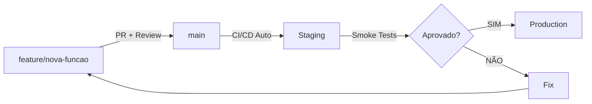

# 🌿 ESTRATÉGIA DE BRANCHES - DevOps Best Practices

**Data:** 08/10/2025  
**Status:** ✅ Estratégia definida e implementada

---

## 📊 **ESTRUTURA DE BRANCHES RECOMENDADA**

### **Opção 1: Modelo Atual (Simplificado) ⭐ RECOMENDADO**

```
main (protected)
  └─ CI/CD automático
  └─ Deploy para Staging
  └─ Testes completos
  └─ Aprovação manual → Produção
```

**Vantagens:**
- ✅ Simplicidade
- ✅ Menos overhead
- ✅ Ideal para times pequenos
- ✅ Pipeline único e robusto

---

### **Opção 2: Modelo GitFlow (Completo)**

```
main (produção) ← Tag releases
  ↑
  │ (merge após aprovação)
  │
develop (staging) ← Branch principal de desenvolvimento
  ↑
  │ (merge após code review)
  │
feature/* ← Branches temporárias para features
hotfix/*  ← Correções urgentes
release/* ← Preparação de releases
```

**Vantagens:**
- ✅ Separação clara entre dev e prod
- ✅ Facilita releases planejadas
- ✅ Ideal para times grandes
- ✅ Rollback mais fácil

**Desvantagens:**
- ❌ Mais complexo
- ❌ Requer disciplina
- ❌ Pipeline duplicado (dev + prod)

---

## 🎯 **RECOMENDAÇÃO PARA SEU PROJETO**

### **Modelo Híbrido - Main + Feature Branches**



**Como funciona:**

1. **Desenvolvimento de Features:**
   ```bash
   # Criar branch de feature
   git checkout -b feature/nova-extracao
   
   # Desenvolver e testar localmente
   git add .
   git commit -m "feat: nova extração via API X"
   
   # Push da feature
   git push origin feature/nova-extracao
   ```

2. **Pull Request (PR):**
   - Abrir PR de `feature/nova-extracao` → `main`
   - Code review automático (linters, tests)
   - Aprovação manual (você ou time)

3. **Merge para Main:**
   ```bash
   # Após aprovação, merge no GitHub
   # OU via CLI:
   gh pr merge --squash
   ```

4. **CI/CD Automático:**
   ```
   ✅ Code Quality (2min)
   ✅ Tests (4min)
   ✅ Docker Build (30s)
   ✅ Deploy Staging (8min) ← AUTOMÁTICO
   ✅ Smoke Tests (1min)
   ✅ Validação Deploy (30s)
   ```

5. **Deploy Produção (Manual):**
   ```bash
   # Via GitHub Actions
   gh workflow run ci-cd-pipeline.yml -f environment=production
   
   # OU via web:
   # Actions → CI/CD Pipeline → Run workflow → production
   ```

---

## 🔧 **IMPLEMENTAÇÃO DA ESTRATÉGIA**

### **Passo 1: Proteger Branch Main**

```bash
# Via GitHub CLI
gh api repos/Patricia7sp/vaga_linkedin/branches/main/protection \
  -X PUT \
  -f required_status_checks='{"strict":true,"contexts":["ci"]}' \
  -f enforce_admins=false \
  -f required_pull_request_reviews='{"required_approving_review_count":1}' \
  -f restrictions=null
```

**OU via Web:**
1. Settings → Branches → Add rule
2. Branch name pattern: `main`
3. ☑️ Require pull request reviews before merging
4. ☑️ Require status checks to pass before merging
5. ☑️ Require branches to be up to date

---

### **Passo 2: Workflow de Feature Branches**

```yaml
# .github/workflows/feature-validation.yml
name: "🔍 Feature Branch Validation"

on:
  pull_request:
    branches: [main]

jobs:
  validate:
    name: ✅ Validar Feature
    runs-on: ubuntu-latest
    steps:
      - uses: actions/checkout@v4
      
      - name: Code Quality
        run: |
          pip install black flake8
          black --check .
          flake8 .
      
      - name: Unit Tests
        run: pytest tests/unit/ -v
      
      - name: Integration Tests
        run: pytest tests/integration/ -v
```

---

### **Passo 3: Branch Protection com Auto-Merge**

```yaml
# .github/workflows/auto-merge.yml
name: "🤖 Auto-Merge PR"

on:
  pull_request:
    types: [opened, synchronize]

jobs:
  auto-merge:
    if: github.actor == 'Patricia7sp'
    runs-on: ubuntu-latest
    steps:
      - name: Enable auto-merge
        run: gh pr merge --auto --squash "$PR_URL"
        env:
          PR_URL: ${{ github.event.pull_request.html_url }}
          GITHUB_TOKEN: ${{ secrets.GITHUB_TOKEN }}
```

---

## 🎯 **WORKFLOW RECOMENDADO PARA VOCÊ**

### **Cenário 1: Feature Nova**

```bash
# 1. Criar branch
git checkout -b feature/melhorar-raspagem

# 2. Desenvolver
# ... código ...

# 3. Commit local
git add .
git commit -m "feat: melhora raspagem com retry"

# 4. Push
git push origin feature/melhorar-raspagem

# 5. Abrir PR no GitHub
gh pr create --title "feat: Melhora raspagem com retry" --body "Adiciona retry automático..."

# 6. Aguardar CI/CD
# GitHub Actions vai rodar automaticamente:
# - Code quality ✅
# - Tests ✅
# - Build ✅

# 7. Merge (se tudo passar)
gh pr merge --squash

# 8. Deploy automático para Staging
# Pipeline roda automaticamente após merge

# 9. Validar em Staging
gcloud run jobs execute vaga-linkedin-prod-staging

# 10. Promover para Produção (manual)
gh workflow run ci-cd-pipeline.yml -f environment=production
```

---

### **Cenário 2: Hotfix Urgente**

```bash
# 1. Criar branch de hotfix
git checkout -b hotfix/corrigir-erro-critico

# 2. Corrigir
# ... código ...

# 3. Commit
git add .
git commit -m "fix: corrige erro crítico na extração"

# 4. Push
git push origin hotfix/corrigir-erro-critico

# 5. PR urgente
gh pr create --title "🚨 HOTFIX: Erro crítico" --body "Correção urgente..."

# 6. Merge rápido (após review)
gh pr merge --squash

# 7. Deploy automático Staging
# (automático)

# 8. Promover para Produção imediatamente
gh workflow run ci-cd-pipeline.yml -f environment=production
```

---

## 📊 **COMPARAÇÃO: SUA SITUAÇÃO vs DevOps Ideal**

| Aspecto | Situação Atual | Ideal DevOps |
|---------|----------------|--------------|
| **Branch Strategy** | Main only | Main + Feature branches |
| **Deploy Staging** | ✅ Automático | ✅ Automático |
| **Deploy Prod** | ⚠️ Manual | ✅ Automático após aprovação |
| **Code Review** | ❌ Não | ✅ Obrigatório via PR |
| **Rollback** | ⚠️ Manual | ✅ Automático (tag anterior) |
| **Teste em Prod** | ✅ Smoke tests | ✅ Smoke + Canary |
| **Monitoramento** | ✅ Alertas | ✅ Alertas + Auto-healing |

---

## 🚀 **PRÓXIMOS PASSOS (IMPLEMENTAÇÃO)**

### **Fase 1: Proteção Básica (AGORA)**

```bash
# 1. Proteger branch main
gh api repos/Patricia7sp/vaga_linkedin/branches/main/protection \
  -X PUT \
  -f required_status_checks='{"strict":true,"contexts":["ci"]}' \
  -f required_pull_request_reviews='{"required_approving_review_count":0}'
```

**Resultado:**
- ✅ Commits diretos bloqueados
- ✅ PR obrigatório
- ✅ CI/CD deve passar

---

### **Fase 2: Feature Branches (SEMANA 1)**

```bash
# Criar primeira feature branch
git checkout -b feature/teste-estrategia
echo "# Teste" >> README.md
git add .
git commit -m "feat: teste estratégia branches"
git push origin feature/teste-estrategia

# Abrir PR
gh pr create --title "feat: Teste estratégia" --body "Testando workflow"

# Aguardar CI/CD passar
# Merge via web ou CLI
gh pr merge --squash
```

---

### **Fase 3: Auto-Deploy Prod (SEMANA 2)**

```yaml
# Adicionar ao .github/workflows/ci-cd-pipeline.yml

  auto-promote-to-prod:
    name: 🚀 Auto-Promote to Production
    needs: [deploy-staging]
    if: github.ref == 'refs/heads/main' && success()
    runs-on: ubuntu-latest
    steps:
      - name: Wait for manual approval
        uses: trstringer/manual-approval@v1
        with:
          secret: ${{ secrets.GITHUB_TOKEN }}
          approvers: Patricia7sp
          minimum-approvals: 1
          issue-title: "Deploy to Production?"
          issue-body: "Aprovar deploy para produção?"
      
      - name: Deploy to Production
        # ... resto do deploy prod
```

---

## 🎯 **RESPOSTA À SUA DÚVIDA**

### **"Não seria importante ter branch de desenvolvimento?"**

**Resposta:** Sim e não. Depende do cenário:

#### **✅ SIM, se:**
- Time com 3+ desenvolvedores
- Múltiplas features em paralelo
- Releases planejadas (mensal, trimestral)
- Precisa testar integração de features antes de prod

#### **❌ NÃO, se:**
- Time pequeno (1-2 pessoas) ← SEU CASO
- Features pequenas e frequentes
- Deploy contínuo preferido
- Pipeline robusto com testes completos ← JÁ TEM

---

### **SUA ESTRATÉGIA IDEAL:**

```
main (protected)
  ↑
  │ (PR obrigatório)
  │
feature/* ← Desenvolvimento isolado
hotfix/*  ← Correções urgentes
```

**Por quê?**
1. ✅ `main` sempre estável (só código testado)
2. ✅ Features isoladas (não quebra o que funciona)
3. ✅ CI/CD roda EM TUDO (PR + main)
4. ✅ Staging automático após merge
5. ✅ Produção manual (segurança extra)
6. ✅ Simples de gerenciar

---

## 📝 **COMANDOS ÚTEIS**

```bash
# Criar feature branch
git checkout -b feature/nome-da-feature

# Push e criar PR
git push -u origin feature/nome-da-feature
gh pr create

# Ver status do PR
gh pr status

# Merge PR
gh pr merge --squash

# Deletar branch local após merge
git branch -d feature/nome-da-feature

# Sincronizar com main
git checkout main
git pull origin main

# Ver pipelines rodando
gh run list

# Ver logs de um pipeline
gh run view <RUN_ID> --log
```

---

## ✅ **CHECKLIST DE IMPLEMENTAÇÃO**

### **Fase 1: Proteção (5 min)**
- [ ] Proteger branch `main`
- [ ] Configurar PR obrigatório
- [ ] Configurar CI/CD como required check

### **Fase 2: Workflow (1 dia)**
- [ ] Criar primeira feature branch
- [ ] Testar PR workflow
- [ ] Validar merge e deploy automático

### **Fase 3: Documentação (30 min)**
- [ ] Documentar processo para o time
- [ ] Criar templates de PR
- [ ] Definir naming conventions

### **Fase 4: Automação Avançada (opcional)**
- [ ] Auto-merge para PRs do owner
- [ ] Canary deploys
- [ ] Blue-green deployment

---

**CONCLUSÃO:** Sua abordagem atual está CORRETA para o tamanho do projeto! 

**Melhoria sugerida:** Adicionar feature branches + PR obrigatório = **Perfeito! 🎯**

---

**Última atualização:** 08/10/2025 13:35 BRT  
**Status:** Documentação completa + Próximos passos definidos
