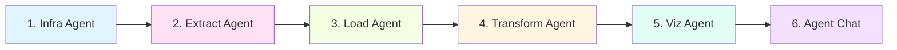

# 📁 Estrutura do Projeto - Vagas LinkedIn

## 🎯 Design Pattern: Clean Architecture + Domain-Driven Design

Este projeto segue princípios de **Clean Architecture** e **Domain-Driven Design** para manter código organizado, testável e manutenível.

---

## 📂 Estrutura de Diretórios

```
vaga_linkedin/
│
├── 🚀 app_production/              # CÓDIGO DE PRODUÇÃO (Cloud Run + Databricks)
│   ├── agents/                     # Agentes do pipeline (arquitetura modular)
│   │   ├── control_agent/          # Orquestrador principal do pipeline
│   │   ├── extract_agent/          # Extração de dados do LinkedIn
│   │   ├── load_agent/             # Carregamento no Unity Catalog
│   │   ├── transform_agent/        # Transformações DLT (Bronze→Silver→Gold)
│   │   ├── infra_agent/            # Configuração de infraestrutura
│   │   └── viz_agent/              # Criação de visualizações e dashboards
│   │
│   ├── notebooks/                  # Notebooks Databricks
│   │   ├── agent_chat_standalone.py
│   │   └── linkedin_pipeline_runner_notebook.py
│   │
│   └── agent_chat.py               # Notificações via Telegram
│
├── 🔧 scripts/                     # SCRIPTS UTILITÁRIOS
│   ├── debug/                      # Scripts de debugging
│   │   ├── debug_linkedin.py
│   │   ├── debug_click_capture.py
│   │   └── ...
│   │
│   ├── sql/                        # Scripts SQL
│   │   ├── create_raw_tables.sql
│   │   └── temp_catalog.sql
│   │
│   ├── monitoring/                 # Scripts de monitoramento
│   ├── extract_simple.py           # Extração simples para testes
│   ├── run_extraction_only.py      # Executar apenas extração
│   └── kafka_real_time_alerts.py   # Alertas em tempo real
│
├── 📚 docs/                        # DOCUMENTAÇÃO
│   ├── devops/                     # Documentação DevOps
│   │   ├── DEVOPS_ARCHITECTURE.md  # Arquitetura
│   │   ├── DEVOPS_PLAN.md          # Plano DevOps
│   │   ├── DEVOPS_QUICKSTART.md    # Guia rápido
│   │   └── DEVOPS_SUMMARY.md       # Resumo
│   │
│   ├── setup/                      # Guias de setup
│   │   ├── GMAIL_SETUP.md          # Configuração Gmail
│   │   └── PRODUCAO_vs_DESENVOLVIMENTO.md
│   │
│   └── PROJECT_STRUCTURE.md        # Este arquivo
│
├── 🧪 tests/                       # TESTES AUTOMATIZADOS
│   ├── unit/                       # Testes unitários
│   ├── integration/                # Testes de integração
│   └── e2e/                        # Testes end-to-end
│
├── 🏗️ terraform/                   # INFRAESTRUTURA COMO CÓDIGO
│   └── ...                         # Configurações Terraform
│
├── ⚙️ .github/workflows/           # CI/CD PIPELINES
│   └── databricks-deploy.yml       # Deploy automático Databricks
│
├── 📊 data_extracts/               # DADOS EXTRAÍDOS (não versionado)
├── 🔬 desenvolvimento/             # DESENVOLVIMENTO E PROTOTIPAGEM
├── 📦 vagas_linkedin/              # PACOTE PYTHON (se aplicável)
├── 🗄️ .archive/                    # ARQUIVOS TEMPORÁRIOS/ANTIGOS
│
├── 📄 Readme.md                    # README principal
├── 📄 requirements.txt             # Dependências Python
├── 📄 Dockerfile                   # Container Docker
└── 📄 pyproject.toml               # Configuração do projeto
```

---

## 🏛️ Princípios de Arquitetura

### 1. **Separação de Responsabilidades**
- **`app_production/`**: Código que roda em produção (imutável, versionado)
- **`scripts/`**: Utilitários e ferramentas de desenvolvimento
- **`docs/`**: Documentação centralizada
- **`tests/`**: Testes isolados do código de produção

### 2. **Domain-Driven Design (DDD)**
- Cada agente é um **bounded context** independente
- Agentes se comunicam via interfaces bem definidas
- Control Agent atua como **Application Service** orquestrando domínios

### 3. **Clean Architecture**
```
┌─────────────────────────────────────┐
│   Interface (Notebooks/CLI)         │
├─────────────────────────────────────┤
│   Application (Control Agent)       │
├─────────────────────────────────────┤
│   Domain (Agents: Extract, Load,    │
│            Transform, Viz, Infra)   │
├─────────────────────────────────────┤
│   Infrastructure (Databricks, GCP)  │
└─────────────────────────────────────┘
```

### 4. **Dependency Rule**
- Dependências apontam **para dentro** (do externo para o core)
- Core do negócio (agentes) **não depende** de infraestrutura
- Infraestrutura adapta-se ao core (Dependency Inversion)

---

## 🔄 Pipeline de Dados (6 Agentes)



1. **Infra Agent**: Configuração GCP/Databricks
2. **Extract Agent**: Extração LinkedIn
3. **Load Agent**: Carregamento Unity Catalog
4. **Transform Agent**: DLT Bronze→Silver→Gold
5. **Viz Agent**: Dashboards Lakeview
6. **Agent Chat**: Notificações Telegram

---

## 🚀 CI/CD Pipeline

**Workflow**: `.github/workflows/databricks-deploy.yml`

**Fluxo**:
1. ✅ Commit no `main`
2. ✅ Validação (linting, testes)
3. ✅ Deploy notebooks DLT
4. ✅ Deploy agent_chat
5. ✅ Deploy pipeline_runner

**Notebooks Deployados**:
- `/Shared/dlt_data_engineer_transformation`
- `/Shared/dlt_data_analytics_transformation`
- `/Shared/dlt_digital_analytics_transformation`
- `/Shared/agent_chat_standalone`
- `/Shared/linkedin_pipeline_runner_notebook`

---

## 📝 Convenções

### Nomenclatura
- **Pastas**: `snake_case` (ex: `extract_agent`)
- **Arquivos Python**: `snake_case.py` (ex: `agent_chat.py`)
- **Classes**: `PascalCase` (ex: `ExtractAgent`)
- **Funções**: `snake_case()` (ex: `run_pipeline()`)

### Commits
Formato: `type(scope): message`

Tipos:
- `feat`: Nova funcionalidade
- `fix`: Correção de bug
- `docs`: Documentação
- `refactor`: Refatoração
- `test`: Testes
- `ci`: CI/CD
- `chore`: Manutenção

Exemplo: `fix(dlt): remove dropDuplicates bloqueando dados novos`

---

## 🔐 Segurança

- ❌ **NUNCA** commitar `.env` com secrets
- ✅ Usar `.env.example` como template
- ✅ Secrets via GitHub Secrets / Databricks Secrets
- ✅ Arquivos sensíveis no `.gitignore`

---

## 🤝 Como Contribuir

1. Clone o repositório
2. Crie branch: `git checkout -b feat/sua-feature`
3. Faça mudanças em `app_production/` (produção)
4. Teste localmente
5. Commit: `git commit -m "feat: descrição"`
6. Push: `git push origin feat/sua-feature`
7. Abra Pull Request

---

## 📚 Documentação Adicional

- [Arquitetura DevOps](./devops/DEVOPS_ARCHITECTURE.md)
- [Guia Rápido](./devops/DEVOPS_QUICKSTART.md)
- [Setup Gmail](./setup/GMAIL_SETUP.md)
- [Produção vs Desenvolvimento](./setup/PRODUCAO_vs_DESENVOLVIMENTO.md)

---

**Última atualização**: 2025-10-17  
**Mantido por**: Equipe Vagas LinkedIn
